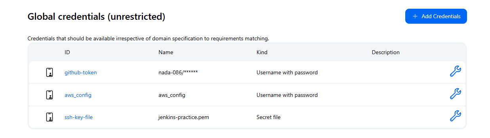
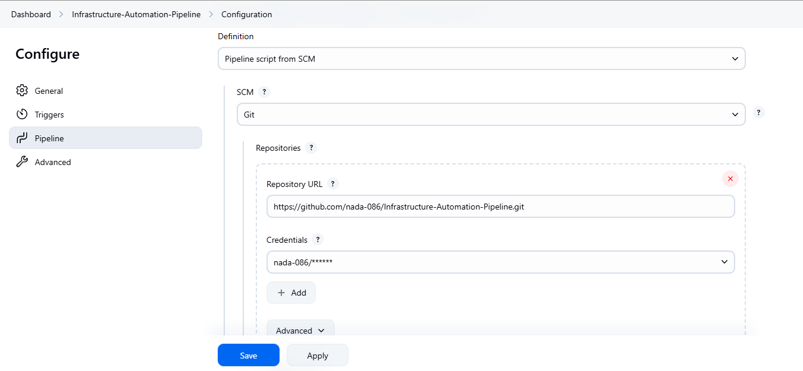

# 🚀 Infrastructure Automation Pipeline

Automate your cloud infrastructure provisioning and configuration using **Jenkins**, **Terraform**, and **Ansible**.

---

## 📦 Prerequisites: Installing Required Tools

### 1. [Jenkins](https://www.jenkins.io/doc/book/installing/linux/)
Set up Jenkins on your Linux-based system using official instructions.

### 2. [Ansible](https://docs.ansible.com/ansible/latest/installation_guide/intro_installation.html)
```bash
sudo yum provides ansible
# Choose the latest version from the results
sudo yum install ansible-x.x.x
```

### 3. [Terraform](https://developer.hashicorp.com/terraform/install)
Follow the official guide to install Terraform on your system.

---

## 🔐 Setting Up Credentials in Jenkins

### GitHub Token
- Generate a token from: **GitHub → Settings → Developer Settings → Personal Access Tokens**
- Add to Jenkins: **Credentials → Kind: "Username with password"**

### AWS Credentials
- Create an AWS Access Key and Secret in the AWS Console
- Add both to Jenkins as a **"Username with password"** credential

### SSH Key (for EC2 Access)
- Create an AWS key pair (in `.pem` format for Linux)
- Upload to Jenkins as a **"Secret file"** credential

> 📸 **Example:**  


---

## 🔧 Creating the Jenkins Pipeline

1. Create a new **Pipeline** project in Jenkins  
2. Choose **Git** as the SCM  
3. Add your repository URL  
4. Configure GitHub credentials  

> 📸 **Example Configuration:**  


---

## ⚙️ Pipeline Workflow Overview

The Jenkins pipeline automates provisioning and configuration in sequential stages:

### 1️⃣ Provision Infrastructure
- Jenkins retrieves AWS credentials
- Terraform:
  - Creates security groups
  - Launches an EC2 instance

### 2️⃣ Extract EC2 Public IP
- Retrieves the instance’s public IP using Terraform outputs

### 3️⃣ Configure EC2 with Ansible
- Dynamically creates an inventory using the public IP and SSH key
- Runs a playbook to:
  - Install Apache (HTTPD)
  - Enable and start the service
  - Deploy a basic HTML page

### 4️⃣ (Optional) Destroy Infrastructure
- Run `terraform destroy` to tear down resources  
  *(commented out by default for safety)*

---

## 📁 Project Folder Structure

```
├── Ansible/
│   ├── inventory          # Dynamically generated Ansible inventory
│   └── httpd.yml          # Apache installation and configuration
├── Terraform/
│   ├── main.tf            # Infrastructure definition (EC2, security groups, etc.)
│   └── variables.tf       # Input variables for flexibility
├── Jenkinsfile            # Pipeline configuration script
└── README.md              # Project documentation
```
